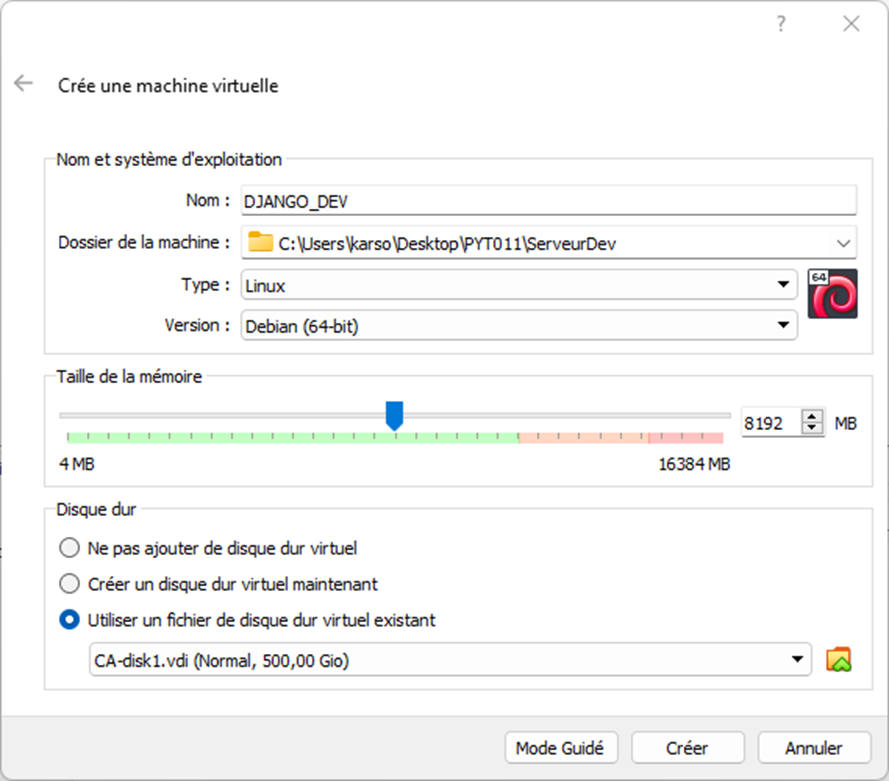
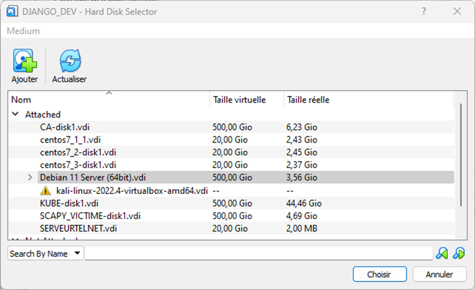
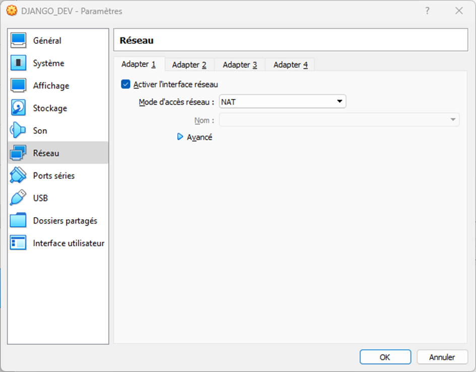
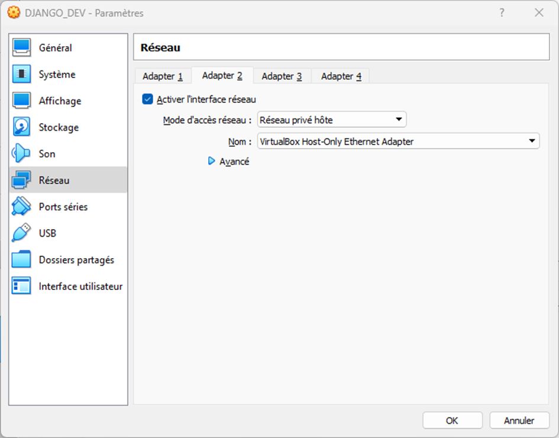
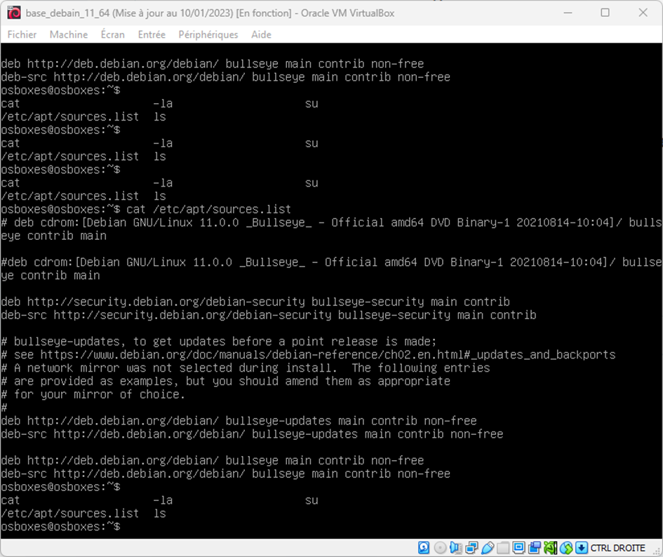
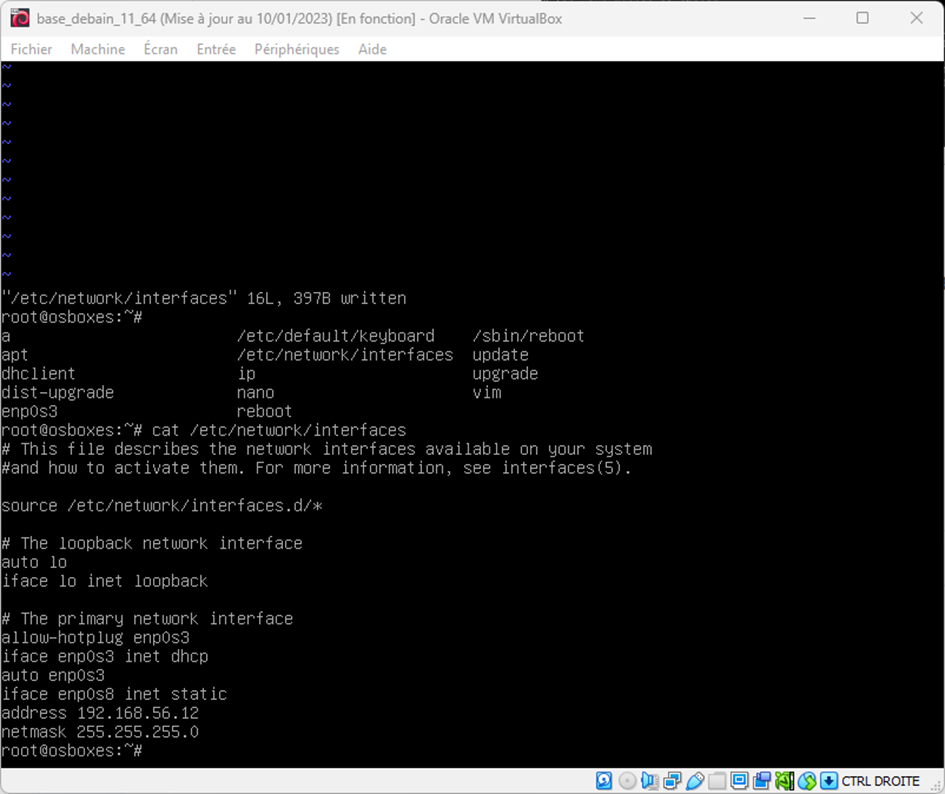
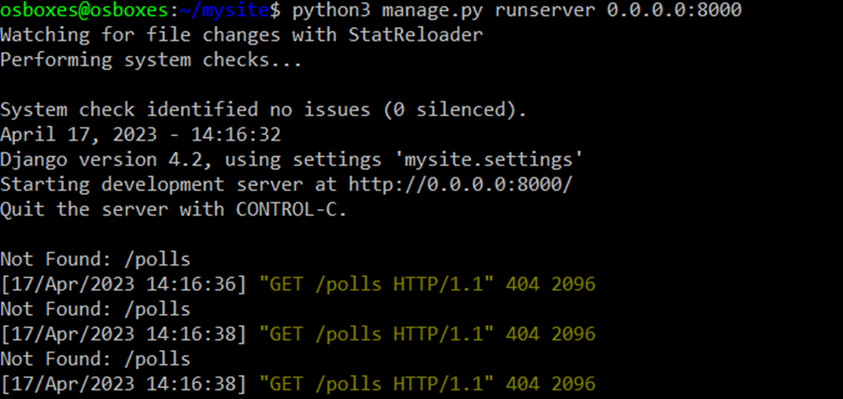

[1]: https://docs.djangoproject.com/en/4.2/ "Django 4.2"
[2]: https://docs.python.org/fr/3/ "Python 3"
[3]: https://scapy.readthedocs.io/en/latest/ "Scapy 2.5.0"
[4]: https://sourceforge.net/projects/osboxes/files/v/vb/14-D-b/11/Server/64bit.7z/download "Debian 11"
[5]: https://www.osboxes.org/ "OSBoxes"

# Procédure de déploiement
## Prérequis :
-	On a déjà [Django 4.2][1]
-	On a [Python 3][2] installé
-	On a [Scapy 2.5.0][3] installé
-   On a VM avec [Debian 11][4]

# Pour lancer le projet :

Avoir pris le projet :

```
git clone https://github.com/JulienLay/eval-django.git
```

# Méthode de déploiement rapide d'un serveur virtuel
1.	Se rendre sur le site [OSBoxes][5] et télécharger la machine de votre choix
    1.	Pour Django on utilisera une [Debian 11][4] serveur
    2.	L'exemple sera donné avec VirtualBox mais fonctionne avec n'importe quelle solution de virtualisation
2.	Dézipper le disque de machine virtuelle téléchargée
3.	Créer une nouvelle machine virtuelle utilisant un disque existant

4.	Ajouter le disque téléchargé à la machine virtuelle

1.	Configurer la machine virtuelle avec 2 interfaces :
    1.	Une configurée en NAT pour accéder à internet afin de faire les mises à jour et installations
    
    2.	Une configurée en réseau privé d'hôte pour permettre à votre machine hôte d'y accéder en SSH
    
2.	Dans la VM, se logger (clavier UK) avec
```
osboxes/osboxes.org
```
```
root/osboxes.org
```
7.	Une fois loggé en root
    1.	Modifier le fichier avec la commande suivante pour avoir les lignes non commentés ci dessous

    ```
    nano /etc/apt/sources.list
    ```
    

    2.
    ```
    apt update -y && apt upgrade -y
    ```
    3.
    ```
    apt install openssh-server #installation serveur ssh
    ```
    4.
    ```
    systemctl enable ssh
    ```
    5.
    ```
    service sshd start
    ```
    6.	modifier le fichier */etc/network/interfaces* pour configurer en dur l'adresse IP du réseau privé d'hôte
    

    7.	ajouter les lignes suivante avant iface enp0s8

        1.
        ```
        allow-hotplug enp0s8
        ```
        2.
        ```
        auto enp0s8
        ```
    8.
    ```
    service networking restart
    ```
    9.
    ```
    service sshd restart
    ```
4.	Depuis votre hôte (invite de commande) : accéder à votre machine en faisant

    1.
    ```
    ssh osboxes@192.168.56.12
    ```
    2.
    ```
    sudo apt install python3
    ```
    3.
    ```
    python3 –version
    ```
    4.
    ```
    sudo apt install python3-pip
    ```
    5.
    ```
    python3 -m pip install Django
    ```
    6.
    ```
    sudo apt install mariadb-server
    ```
    7.
    ```
    python3 -m django startproject mysite
    ```
    8.
    ```
    python3 manage.py runserver
    ```
    9.
    ```
    python3 manage.py migrate
    ```
    10.
    ```
    python3 manage.py runserver
    ```
    11.
    ```
    python manage.py startapp polls
    ```
    12.
    ```
    cd ..
    ```
    13.
    ```
    python3 manage.py runserver 0.0.0.0:8000
    ```
    14.
    ```
    nano settings.py --> rajouter 192.168.56.12 dans le tableau ALLOWED_HOSTS
    ```


# Pour lancer le serveur

Pour aller dans le dossier de l’application :

```
cd mysite/
```
Pour lancer l’application :
```
python3 manage.py runserver 0.0.0.0:8000
```


 
## LES ROUTES DE L'APPLICATION :

### GENERALE

http://localhost:8000/polls/authentification/

### ANALYSTE

http://localhost:8000/polls/demande_capture/

http://localhost:8000/polls/observer_capture/

http://localhost:8000/polls/observer_capture/<id_capture>

### EXPERT

http://localhost:8000/expert/observer_capture/

http://localhost:8000/expert/observe_capture/<id_capture>

http://localhost:8000/expert/delete_capture/<id_capture>

http://localhost:8000/expert/demarrer_capture/

http://localhost:8000/expert/enregistrer_capture/

http://localhost:8000/expert/captures_courantes/